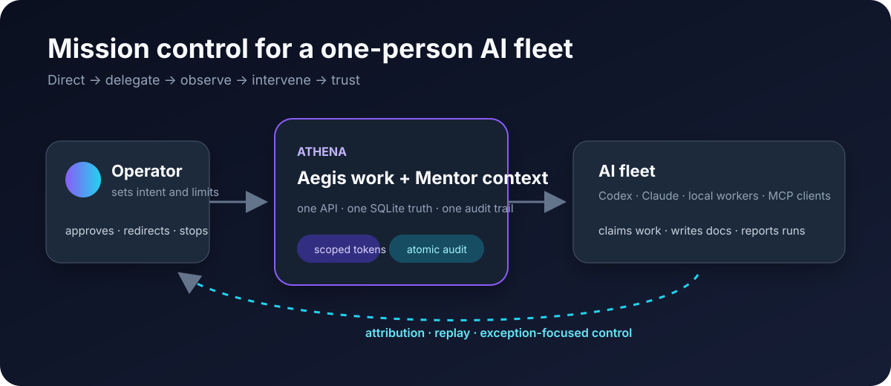
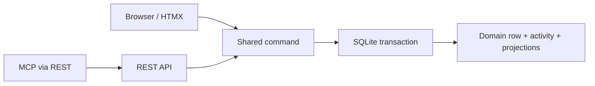

# Athena

[](https://github.com/Ayyitskevin/athena/actions/workflows/ci.yml)

[](LICENSE)


**Mission control for a one-person AI fleet.**

Athena is a self-hosted workspace where a solo operator directs agents, gives
them durable context, watches their work, intervenes when necessary, and can
later reconstruct what happened. Markdown docs, issue tracking, cross-links,
and an append-only activity trail live in one SQLite-backed FastAPI app.



- **One roof:** Mentor knowledge pages and Aegis work items link to each other.
- **Agents are actors:** scoped tokens, MCP, run lineage, delegation, and a
  credential kill switch are product primitives.
- **Operator-owned:** one process, one database, no JavaScript build chain, and
  no vendor cloud required.

> Notion's shape. Your machine. Built for agents.

## Try it in five minutes

Athena supports Python 3.12 (`>=3.12,<3.13`), the only version verified in CI.
The demo creates synthetic data in a new database, prints a disposable login,
and serves only on `127.0.0.1`.

```bash
git clone https://github.com/Ayyitskevin/athena.git
cd athena
python3.12 -m venv .venv
.venv/bin/python -m pip install \
  -c constraints/ci-py312.txt -e ".[dev,mcp]"
.venv/bin/athena-demo --db /tmp/athena-review.db
```

Sign in with the printed credentials. Then follow:

1. the dashboard into the **Athena Review** project;
2. an assigned issue into its append-only activity;
3. the agent cockpit and the seeded `demo-sol-run-001` facts; and
4. **Operator Playbook → Fleet operating guide** into its linked issues.

The command refuses to overwrite an existing database or attachment path,
disables webhook delivery and automation, and has no public-bind option. Use
`--seed-only` to create the workspace without starting the server. See
[REVIEW_GUIDE.md](REVIEW_GUIDE.md) for a focused 30-minute code tour.

## The operator loop

| Step | Athena makes it concrete |
|---|---|
| Direct | Projects, issues, docs, dependencies, and bounded work-context packets |
| Delegate | Named agent users, assignments, contributors, scoped bearer tokens, and MCP |
| Observe | Append-only activity, webhooks, run check-ins, replay, and lineage |
| Intervene | Reassignment, token revocation, full offboarding, and explicit audit facts |
| Trust | Idempotency, visibility envelopes, deterministic history, import/export, and backups |

This is the differentiator: Athena is not a general notes app with an AI button.
The human and agents share the same durable work model, while the operator keeps
the authority and evidence needed to supervise it.

## Product surface

### Mentor — knowledge

Spaces, nested Markdown pages, version history, comments, labels, search,
wikilinks, and backlinks. A page can reference `[[issue:42]]` or
`[[ATH-12]]`; the shared link index makes the relationship visible from both
sides.

### Aegis — work

Projects, issues, configurable statuses, boards, sprints, priorities, labels,
dependencies, filters, comments, watches, and automation, plus a
[work query language](docs/QUERY.md) (`is:open label:infra assignee:@me`)
shared by the browser, REST, MCP, and saved filters. Issue writes maintain
their activity, search, link, mention, and notification projections through a
shared command transaction.

### Fleet controls

Agent identities, role-plus-token-scope authorization, MCP access, request
idempotency, rate limits, run correlation and lineage, cooperative check-ins,
delegation, replay artifacts, webhooks, an audited kill switch, and bounded
[active-work supervision](docs/ACTIVE_WORK.md) that keeps leases distinct from
cooperative reports, plus [fleet throughput metrics](docs/FLEET_METRICS.md) whose
aggregates obey the same event visibility rules as the activity trail.

## Architecture reviewers can challenge



The database is the sole data owner; the web layer is a thin client. New writes
must have one command that owns authorization, validation, persistence, derived
state, and audit emission. The migration is intentionally incremental, and the
remaining split write paths are listed in
[docs/COMMAND_MIGRATION.md](docs/COMMAND_MIGRATION.md).

Code map:

| Area | Path | Responsibility |
|---|---|---|
| Core | `src/athena/core/` | DB, auth, users, tokens, activity, search, links, portability |
| Aegis | `src/athena/aegis/` | Work data, commands, and REST adapters |
| Mentor | `src/athena/mentor/` | Knowledge data and REST adapters |
| Web | `src/athena/web/` | Server-rendered Jinja/HTMX transport |
| Tests | `tests/` | Behavioral, authorization, concurrency, packaging, and security contracts |

Read [docs/ARCHITECTURE.md](docs/ARCHITECTURE.md) for the design of record and
[docs/VISION.md](docs/VISION.md) for the product steering rules.

## Evidence

Every pull request runs the repository's
[public GitHub Actions workflow](.github/workflows/ci.yml) on Linux/Python
3.12. From a clean checkout, the local gate through the required full-suite
coverage run is:

```bash
python3.12 -m venv .venv
.venv/bin/python -m pip install \
  -c constraints/ci-py312.txt -e ".[dev,mcp]"
.venv/bin/python -m pip check
.venv/bin/python -m pip freeze --exclude-editable \
  | diff -u constraints/ci-py312.txt -
.venv/bin/python -m ruff check .
.venv/bin/python -m ruff format --check .
.venv/bin/python -m mypy src/athena
.venv/bin/python scripts/check_import_contracts.py
scripts/coverage.sh
```

The suite includes a **field exercise** (`scripts/field_exercise.py`, run by
`tests/test_field_exercise.py`): a real Athena process and the reference
executor from [`examples/icarus_executor.py`](examples/icarus_executor.py)
drive the full operator loop — onboard, delegate, claim, heartbeat, gated
dispatch, approval, signed delivery and callbacks, a promoted learning, and an
undo — over real loopback HTTP, with nothing stubbed.

The coverage script runs the complete test suite with full-source branch
coverage and enforces the floors in `pyproject.toml`. The current baseline, final
evidence, explicit non-runs, and release blockers live in
[`docs/RELEASE_READINESS.md`](docs/RELEASE_READINESS.md). CI then builds an sdist
and its wheel in isolation, verifies the packaged runtime files from both the
checkout and extracted sdist, installs the wheel, and runs the process smoke
outside the checkout. The exact local packaging recipe is in
[CONTRIBUTING.md](CONTRIBUTING.md); the constrained dependency graph is
[`constraints/ci-py312.txt`](constraints/ci-py312.txt).

## Status and boundaries

**Local alpha (`0.1.0a1`).** Athena is intended for a solo operator or a tiny
trusted team on one machine or tailnet. It is not yet:

- a hosted multi-tenant service;
- an enterprise permission, SCIM, or SAML platform;
- a real-time collaborative block editor;
- a general workflow engine; or
- a claim of complete command migration or general undo.

Durable per-agent action budgets **are** implemented (opt-in; see
[docs/AGENT_BUDGETS.md](docs/AGENT_BUDGETS.md)). They meter actions, not tokens or
dollars — Athena never observes an agent's model spend.

Human-in-the-loop **approval gates are implemented** too (opt-in, two action kinds
— `issue.close` and `dispatch.request`; see
[docs/APPROVALS.md](docs/APPROVALS.md)). A gated action is
refused with a recorded ask that the operator approves or rejects; approval
authorizes one retry, not a stored side effect. That is a bounded first slice,
not a general approval workflow.

The app includes password login, optional OIDC, CSRF protection, secure headers,
visibility-aware reads, scoped tokens, SSRF-hardened webhooks (with an explicit
opt-in allowlist for receivers on your own machine or tailnet —
`ATHENA_EGRESS_PRIVATE_HOSTS`), portability tools,
and operational health checks. Exposing any self-hosted app publicly still
requires deliberate TLS, secret, proxy, backup, and monitoring configuration;
see [SECURITY.md](SECURITY.md) and
[docs/OPERATIONS.md](docs/OPERATIONS.md).

## Development

```bash
python3.12 -m venv .venv
.venv/bin/python -m pip install \
  -c constraints/ci-py312.txt -e ".[dev,mcp]"
.venv/bin/uvicorn athena.main:app --reload
```

Before submitting a change, run the complete local gate documented in
[CONTRIBUTING.md](CONTRIBUTING.md).

The app migrates SQLite on startup. Runtime health endpoints are `/healthz`
and `/readyz`. The first user bootstraps as admin; browser admins manage users
at `/admin/users` and scoped API tokens at `/settings/tokens`.

## Project guides

- [REVIEW_GUIDE.md](REVIEW_GUIDE.md) — bounded peer-review path and questions
- [CONTRIBUTING.md](CONTRIBUTING.md) — setup, workflow, and architecture guardrails
- [SECURITY.md](SECURITY.md) — trust boundary and private reporting
- [CHANGELOG.md](CHANGELOG.md) — release-facing changes
- [docs/ROADMAP.md](docs/ROADMAP.md) — where this is going, phase by phase
- [docs/AI_DEVELOPMENT.md](docs/AI_DEVELOPMENT.md) — transparent AI-assisted workflow
- [docs/RUNS.md](docs/RUNS.md) — run replay, lineage, and forking
- [docs/AUTOMATION_SCHEDULES.md](docs/AUTOMATION_SCHEDULES.md) — bounded UTC schedules and recovery
- [docs/WORKFLOW_GATES.md](docs/WORKFLOW_GATES.md) — optional project blocked-close governance
- [docs/AGENT_BUDGETS.md](docs/AGENT_BUDGETS.md) — durable, opt-in per-agent action ceilings
- [docs/APPROVALS.md](docs/APPROVALS.md) — opt-in human-in-the-loop approval gates
- [docs/QUERY.md](docs/QUERY.md) — the work query language, and why unknown atoms are errors
- [docs/UNDO.md](docs/UNDO.md) — undo by compensation, and what is not reversible
- [docs/WORKERS.md](docs/WORKERS.md) — the worker registry and the cooperative kill
- [docs/EXCEPTION_SURFACES.md](docs/EXCEPTION_SURFACES.md) — the attention rollup and security signals
- [docs/RUN_LEARNINGS.md](docs/RUN_LEARNINGS.md) — promoting what a run learned into Mentor
- [docs/DISPATCH.md](docs/DISPATCH.md) — handing work to an external executor, and hearing back
- [docs/ACTIVE_WORK.md](docs/ACTIVE_WORK.md) — claimed-work supervision and attention semantics
- [docs/WORK_CONTEXT.md](docs/WORK_CONTEXT.md) — visibility-safe agent context
- [AGENTS.md](AGENTS.md) — repository contract for human and AI contributors

## License

Athena is licensed under the
[GNU Affero General Public License v3.0 only](LICENSE). Network users of a
modified deployed version must be offered its corresponding source as required
by the license.
