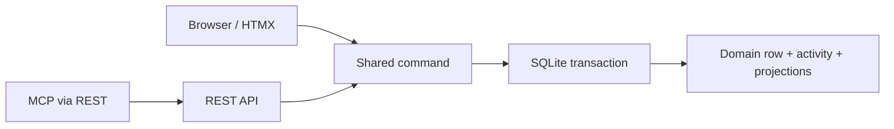

# Athena

[](https://github.com/Ayyitskevin/athena/actions/workflows/ci.yml)

[](LICENSE)


**Mission control for a one-person AI fleet.**

Athena is a self-hosted workspace where a solo operator directs agents, gives
them durable context, watches their work, intervenes when necessary, and can
later reconstruct what happened. Markdown docs, issue tracking, cross-links,
and an append-only activity trail live in one SQLite-backed FastAPI app.


- **One roof:** Mentor knowledge pages and Aegis work items link to each other.
- **Agents are actors:** scoped tokens, MCP, run lineage, delegation, and a
  credential kill switch are product primitives.
- **Operator-owned:** one process, one database, no JavaScript build chain, and
  no vendor cloud required.

> Notion's shape. Your machine. Built for agents.

## Try it in five minutes

Athena requires Python 3.12 or newer. The demo creates synthetic data in a new
database, prints a disposable login, and serves only on `127.0.0.1`.

```bash
git clone https://github.com/Ayyitskevin/athena.git
cd athena
python -m venv .venv
.venv/bin/python -m pip install \
  -c constraints/ci-py312.txt -e ".[dev,mcp]"
.venv/bin/athena-demo --db /tmp/athena-review.db
```

Sign in with the printed credentials. Then follow:

1. the dashboard into the **Athena Review** project;
2. an assigned issue into its append-only activity;
3. the agent cockpit and the seeded `demo-sol-run-001` facts; and
4. **Operator Playbook → Fleet operating guide** into its linked issues.

The command refuses to overwrite an existing database or attachment path,
disables webhook delivery and automation, and has no public-bind option. Use
`--seed-only` to create the workspace without starting the server. See
[REVIEW_GUIDE.md](REVIEW_GUIDE.md) for a focused 30-minute code tour.

## The operator loop

| Step | Athena makes it concrete |
|---|---|
| Direct | Projects, issues, docs, dependencies, and bounded work-context packets |
| Delegate | Named agent users, assignments, contributors, scoped bearer tokens, and MCP |
| Observe | Append-only activity, webhooks, run check-ins, replay, and lineage |
| Intervene | Reassignment, token revocation, full offboarding, and explicit audit facts |
| Trust | Idempotency, visibility envelopes, deterministic history, import/export, and backups |

This is the differentiator: Athena is not a general notes app with an AI button.
The human and agents share the same durable work model, while the operator keeps
the authority and evidence needed to supervise it.

## Product surface

### Mentor — knowledge

Spaces, nested Markdown pages, version history, comments, labels, search,
wikilinks, and backlinks. A page can reference `[[issue:42]]` or
`[[ATH-12]]`; the shared link index makes the relationship visible from both
sides.

### Aegis — work

Projects, issues, configurable statuses, boards, sprints, priorities, labels,
dependencies, filters, comments, watches, and automation. Issue writes maintain
their activity, search, link, mention, and notification projections through a
shared command transaction.

### Fleet controls

Agent identities, role-plus-token-scope authorization, MCP access, request
idempotency, rate limits, run correlation and lineage, cooperative check-ins,
delegation, replay artifacts, webhooks, and an audited kill switch.

## Architecture reviewers can challenge



The database is the sole data owner; the web layer is a thin client. New writes
must have one command that owns authorization, validation, persistence, derived
state, and audit emission. The migration is intentionally incremental, and the
remaining split write paths are listed in
[docs/COMMAND_MIGRATION.md](docs/COMMAND_MIGRATION.md).

Code map:

| Area | Path | Responsibility |
|---|---|---|
| Core | `src/athena/core/` | DB, auth, users, tokens, activity, search, links, portability |
| Aegis | `src/athena/aegis/` | Work data, commands, and REST adapters |
| Mentor | `src/athena/mentor/` | Knowledge data and REST adapters |
| Web | `src/athena/web/` | Server-rendered Jinja/HTMX transport |
| Tests | `tests/` | Behavioral, authorization, concurrency, packaging, and security contracts |

Read [docs/ARCHITECTURE.md](docs/ARCHITECTURE.md) for the design of record and
[docs/VISION.md](docs/VISION.md) for the product steering rules.

## Evidence

Every pull request runs the repository's public GitHub Actions workflow on
Linux/Python 3.12. The gate:

```bash
.venv/bin/python -m ruff check .
.venv/bin/python -m pytest -q
.venv/bin/python scripts/smoke_app.py
```

CI also builds the source distribution, builds a wheel from the extracted
archive, verifies the packaged migrations/templates/static assets against both
sources, installs that wheel, and boots it outside the checkout. The constrained
dependency graph lives in
[`constraints/ci-py312.txt`](constraints/ci-py312.txt).

## Status and boundaries

**Local alpha (`0.1.0a1`).** Athena is intended for a solo operator or a tiny
trusted team on one machine or tailnet. It is not yet:

- a hosted multi-tenant service;
- an enterprise permission, SCIM, or SAML platform;
- a real-time collaborative block editor;
- a general workflow engine; or
- a claim of complete command migration, undo, approvals, or durable agent budgets.

The app includes password login, optional OIDC, CSRF protection, secure headers,
visibility-aware reads, scoped tokens, SSRF-hardened webhooks, portability tools,
and operational health checks. Exposing any self-hosted app publicly still
requires deliberate TLS, secret, proxy, backup, and monitoring configuration;
see [SECURITY.md](SECURITY.md) and
[docs/OPERATIONS.md](docs/OPERATIONS.md).

## Development

```bash
python -m venv .venv
.venv/bin/python -m pip install \
  -c constraints/ci-py312.txt -e ".[dev,mcp]"
.venv/bin/python -m ruff check .
.venv/bin/python -m pytest -q
.venv/bin/python scripts/smoke_app.py
.venv/bin/uvicorn athena.main:app --reload
```

The app migrates SQLite on startup. Runtime health endpoints are `/healthz`
and `/readyz`. The first user bootstraps as admin; browser admins manage users
at `/admin/users` and scoped API tokens at `/settings/tokens`.

## Project guides

- [REVIEW_GUIDE.md](REVIEW_GUIDE.md) — bounded peer-review path and questions
- [CONTRIBUTING.md](CONTRIBUTING.md) — setup, workflow, and architecture guardrails
- [SECURITY.md](SECURITY.md) — trust boundary and private reporting
- [CHANGELOG.md](CHANGELOG.md) — release-facing changes
- [docs/AI_DEVELOPMENT.md](docs/AI_DEVELOPMENT.md) — transparent AI-assisted workflow
- [docs/RUNS.md](docs/RUNS.md) — run replay, lineage, and forking
- [docs/WORK_CONTEXT.md](docs/WORK_CONTEXT.md) — visibility-safe agent context
- [AGENTS.md](AGENTS.md) — repository contract for human and AI contributors

## License

Athena is licensed under the
[GNU Affero General Public License v3.0 only](LICENSE). Network users of a
modified deployed version must be offered its corresponding source as required
by the license.
